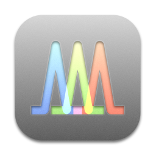

# STRyper

A macOS application for microsatellite genotyping and chromatogram management.

#
STRyper allows you to import and organise FSA/HID files generated by fragment analysis of capillary sequencers. 
It lets you define size standards, marker and bins for genotyping. 
See https://doi.org/10.1371/journal.pone.0318806.

## Requirements
STRyper requires a Mac running macOS 10.13 or higher, as this OS is the development target. However, recent versions have only been tested on macOS ≥13.

## Important
If you are using macOS 15 "Sequoia" or a more recent version, make sure to use STRyper ≥1.2.1. Any previous version will not be compatible. 

## Installation
Download the latest [release](https://github.com/jeanlain/STRyper/releases), unzip the file an put STRyper.app in your "Applications" folder.

## Installation from source
This is only for Xcode users. Clone the repository and open the project in Xcode. You may then build the application from Xcode.

## Usage
The user guide is accessible via the application Help menu and [here](https://github.com/jeanlain/STRyper/raw/main/STRyper/STRyper%20help.pdf).

## How to cite STRyper
If you use this application in any published study, please cite https://doi.org/10.1371/journal.pone.0318806

## Contributing to STRyper development
Please contact Jean Peccoud (contact information are given in https://doi.org/10.1371/journal.pone.0318806).
